# 05. Structural equivalence: two canonical forms, a graph, and an answer that can refute

The structural layer asks one question, whether a candidate is the model its reference is, and it
has exactly two ways to answer conclusively. This page states both, the two canonical forms the
product carries and which one decides, the graph view the workbench adds, and what the layer
actually decided in the published measurement.

## The two tests, in the order copela runs them

`copela.Sweep._structural` fixes the order:

1. **Canonical forms.** Equal forms prove equivalence, and the layer returns `PASS`.
2. **Answers.** When the forms differ, which proves nothing on its own, both models are solved and
   their optima compared. Different optima prove different models, and the layer returns `FAIL`.
3. Otherwise `UNDECIDED`, and never `PASS`: compensating errors reach the right number, which is the
   limitation the anchor survey documents (Xiao et al., arXiv:2508.10047).

$$
\kappa(P_1) = \kappa(P_2) \;\Longrightarrow\; P_1 \equiv P_2,
\qquad
\kappa(P_1) \neq \kappa(P_2) \;\nRightarrow\; P_1 \not\equiv P_2
$$

$$
\hat z(P) = s(P)\, z^\star(P), \quad s = \begin{cases} +1 & \text{minimise} \\ -1 & \text{maximise} \end{cases}
\qquad
\hat z(P_{\text{cand}}) \neq \hat z(P_{\text{ref}}) \;\Longrightarrow\; P_{\text{cand}} \not\equiv P_{\text{ref}}
$$

The negative verdict of the first test is named `NOT_PROVEN_EQUIVALENT`, not `DIFFERENT`, because
that is all it establishes.

### Reading the optima in one sense (copela 0.02.001, R-020)

Maximising f and minimising -f are the same model with optimal values of opposite sign. Before
0.02.001 the two values were compared raw, so that rewrite solved to -z against z and was refuted as
a different optimum: a false `FAIL` on a style rewrite, the one error the layer's asymmetry exists to
avoid. Both are now restated in the minimising sense first. A candidate optimising the same
expression the wrong way is still refuted, unless its optimum is exactly the negative of the
reference's, which reads as `UNDECIDED`, never as `PASS`.

The published ledger was scored by 0.02.000. Neither of its two refutations changes under the fix:
both compare values of the same sign. The calls that did not fail keep no document, so whether any of
them would now be refuted cannot be re-checked; it would take a candidate that optimises in the
opposite sense and still lands exactly on the reference's value. `report.py --check` re-derives the
committed report identically under 0.02.001, because the report reads the verdicts the ledger
recorded rather than re-scoring.

The comparison uses a relative tolerance of `1e-6` against the reference optimum, because two
identical models solved along different paths differ in the last bit. A deliberately infeasible case
is compared on feasibility, and a comparison that cannot be made returns nothing rather than a
verdict: an unmade comparison must not read as a failure any more than as a pass.

## Two canonical forms, and which one decides

| | planteo's document form | the workbench's linear form |
|---|---|---|
| Computed over | the typed document, parameters symbolic | the linear rows, parameters folded in |
| Names | renamed by structural key: role, dimension, domain, bounds, value, usage count | columns ordered by Weisfeiler-Lehman colour class |
| Terms | every sum's terms and product's factors sorted | every term moved to the left-hand side |
| Comparators | the two sides put in a fixed order | each row in one orientation, the equality sign fixed |
| Objective sense | **kept** | fixed to minimise |
| Decides | the published verdict | nothing; it is shown, not published |

The consequence is concrete. The pair below is one model written twice. planteo's form keeps the
objective sense, so it comes out `NOT_PROVEN_EQUIVALENT`; the linear form fixes the sense and moves
every term, so it comes out `EQUIVALENT`.

Neither form can call two different models equivalent: every rewrite each applies keeps the solution
set, so each errs only towards an extra `NOT_PROVEN`. The weaker one decides because it is the one
the measurement was built and audited with. Swapping in the stronger one would change the published
numbers, and it cannot be done after the fact: the ledger keeps a 2,000-character excerpt of a failed
response and nothing of a passing one, never the document. A sweep that stored the document could
apply it.

### The equality-sign defect

The linear form's first version failed its own check, and only looking at the rendered tab showed
it. A row `a·x = b` and its negation `-a·x = -b` are the same constraint, and flipping `>=` to `<=`
does not touch an equality, so the two survived as different rows: the tab's style rewrite changed
the digest, in red, on the case it opened with. The fix, `normaliseRow` in
`frontend/src/lib/model-graph.ts`, picks the one sign under which the row's sorted coefficient tuple
is lexicographically greater than its negation, with the right-hand side breaking a tie.

The method tests (`frontend/tests/methods.test.ts`) prove on all twenty cases that a style rewrite
(sense flipped, sides swapped, names changed, orders reversed) leaves the digest unchanged and that a
one-percent change to one coefficient does not. Undoing the sign rule fails the style test on seven
of the twenty: opt-006, opt-008, opt-009, opt-010, opt-014, opt-016 and opt-020.

## The graph, and colour refinement

The state of the art in this direction, ORGEval (Wang et al., arXiv:2510.27610), turns the model
into a graph and reduces equivalence to isomorphism, through a customised Weisfeiler-Lehman test
plus symmetric-decomposable detection. The workbench's Graph tab builds the same kind of graph and
runs the uncustomised procedure on it:

- one node per variable, one per constraint, one for the objective (its sense fixed to minimise)
- an edge wherever a variable appears in a row or the objective, weighted by its coefficient
- a variable's seed colour is its domain and bounds; a row's is its comparator and right-hand side

Colour refinement, the one-dimensional Weisfeiler-Lehman procedure (Shervashidze et al., JMLR
12(77):2539-2561, 2011), recolours every node from its own colour and the multiset of its
neighbours' colours and edge weights until no class splits:

$$
c^{(t+1)}(v) = \operatorname{hash}\Bigl(c^{(t)}(v),\ \{\!\{ (w_{uv}, c^{(t)}(u)) : u \in N(v) \}\!\}\Bigr)
$$

The histogram of the stable colouring is the signature, and it carries the same asymmetry as the
canonical form:

$$
\operatorname{sig}(G_1) \neq \operatorname{sig}(G_2) \;\Longrightarrow\; G_1 \not\cong G_2,
\qquad
\operatorname{sig}(G_1) = \operatorname{sig}(G_2) \;\nRightarrow\; G_1 \cong G_2
$$

Why an equal signature proves nothing is a theorem. Refinement cannot separate a six-cycle from two
triangles, since in both every node has two neighbours of one colour, and Cai, Fürer and Immerman
(Combinatorica 12(4):389-410, 1992, doi:10.1007/BF01305232) constructed non-isomorphic graphs that
the k-dimensional version cannot separate for any fixed k. ORGEval adds symmetric-decomposable
detection for that reason. The workbench does not, so its verdict is "not distinguished", never
"equal".

Nor does a different signature prove two models inequivalent: a row scaled by two is the same
constraint and a different graph. What it proves is that one model is not the other renamed and
reordered, which is what the tab's label says.

Seeding variables with their domain is what makes the graph see the integrality trap: a model and its
LP relaxation differ from round zero. The method tests prove on all twenty cases that a permutation
leaves the signature alone, that a dropped row and a changed coefficient move it, and that the
relaxation moves it on exactly the four integer cases. Seeding every variable alike instead fails the
relaxation test on all four.

## What the layer decided, measured

In the published measurement (forty calls, two models) sixteen candidates ran. The structural layer
decided two of them, both by refutation:

| Case | Model | Candidate optimum | Reference optimum |
|---|---|---|---|
| opt-006 | claude-haiku-4-5 | 16 | 16.667 |
| opt-012 | claude-sonnet-5 | 8080 | 8200 |

It returned `PASS` on none: not one candidate reproduced its reference's document form. The other
fourteen are `UNDECIDED`, so the faithful verdicts they carry rest on the property layer alone. That
is the honest reading of the headline rate, and the Benchmark page states it.

## What this page is not

It is not a claim that the structural layer can decide equivalence in general. No normaliser can,
and graph isomorphism is not equivalence either. It is a statement of the two narrow directions that
do conclude, and of which code computes them.

## References

- Xiao, Z., et al. A Survey of Optimization Modeling Meets LLMs: Progress and Future Directions.
  arXiv:2508.10047, 2025.
- Wang, Z., Zhu, Z., Li, Z., et al. ORGEval: Graph-Theoretic Evaluation of LLMs in Optimization
  Modeling. arXiv:2510.27610, 2025.
- Shervashidze, N., Schweitzer, P., van Leeuwen, E. J., Mehlhorn, K., Borgwardt, K. M.
  Weisfeiler-Lehman Graph Kernels. JMLR 12(77), 2539-2561, 2011.
  https://jmlr.org/papers/v12/shervashidze11a.html
- Cai, J.-Y., Fürer, M., Immerman, N. An optimal lower bound on the number of variables for graph
  identification. Combinatorica 12(4), 389-410, 1992. doi:10.1007/BF01305232
