# Methodologies

The oracle strategy: what decides whether a formalization is the problem the statement described,
given that no general procedure exists for that question.

Deep pages:

| Page | What it covers |
|---|---|
| [`01_the_oracle_problem.md`](01_the_oracle_problem.md) | why no general oracle exists, and the two substitutes |
| [`02_layers.md`](02_layers.md) | the four layers, what each concludes and what it cannot |
| [`03_relations_per_family.md`](03_relations_per_family.md) | the metamorphic relations, measured and designed |
| [`04_statistics.md`](04_statistics.md) | Wilson intervals, the width, run-to-run variation |
| [`05_structural_equivalence.md`](05_structural_equivalence.md) | the two canonical forms, the graph and colour refinement, answer refutation in one sense |
| [`06_duality_and_integrality.md`](06_duality_and_integrality.md) | shadow prices, the four-part certificate, the relaxation bound, pricing a MIP |



## The measurement, in four lines

```
R_ran       = #{exec = PASS} / (N - u)
R_faithful  = #{exec = PASS and FAIL not in {struct, prop} and PASS in {struct, prop}} / (N - u)
gap         = R_ran - R_faithful   >= 0
u           = cases the instrument could not measure, excluded from both
```

Note the shape of the second numerator: it requires that neither strong layer **fails** and that
at least one **passes**, not that both pass. A structural layer returning UNDECIDED has found nothing
against, and treating that as a failure would penalise the model for a limit of the oracle. Treating
it as a pass is what turns the rate into a rubber stamp: a candidate on which both layers are
undecided has not been shown faithful and is not counted as such, which is why the property layer
and answer refutation must be able to genuinely fail.

This is `copela`'s `Verdicts.faithful`. Two restatements of it in this repository, the report's
breakdowns and CI's standard-library recomputation, had dropped the "at least one passes" clause.
Both agreed with every published number, because the published ledger holds no candidate on which
both strong layers were undecided; agreeing on this data is not being the same rule, and both now
state it in full.

## Why this is the interesting number

The field reports the first rate. Four literatures document that it is not the second:

| Field | Source | What is reported |
|---|---|---|
| Optimization | arXiv:2508.10047 | Objective correctness does not guarantee a correct model |
| Mathematics | arXiv:2606.31002 | A compile-faithfulness gap of 3.0 to 29.0 points; the strongest system has the largest, 89.5% compiling against 60.5% faithful |
| Experiment design | arXiv:2608.03501 | Every model tested is weak at low-level configuration while the high-level plan passes |
| Simulation | arXiv:2605.28994 | Tools do better at discussion and qualitative tasks than at causal reasoning and quantitative fixes |

A 2025 position paper (arXiv:2509.09810, AAAI 2026) argues that autoformalization has outgrown
mathematics and calls for a unified framework connecting fields that already do this without naming
it. It supplies no components, no stages and no faithfulness metric. That absence is the opening.

## The design consequence

Every family gets the same three layers plus a labelled fourth, and they are reported separately,
never merged into one score. The gap between the first and the next two IS the headline measurement,
and nothing found in the research reports that number across families.
